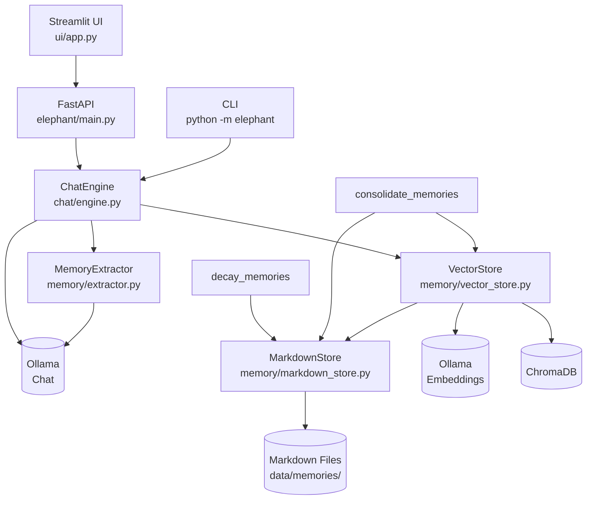

# Elephant — Personal Memory System with RAG

A local-first personal assistant that remembers what matters: conversations, projects, and facts — stored as Markdown files, retrieved via ChromaDB semantic search, and served through a FastAPI + Streamlit interface.

## Features

- **Long-term memory storage** in plain Markdown files with YAML frontmatter
- **ChromaDB RAG** — semantic similarity search over embedded memory chunks
- **Automatic fact extraction** — key facts are extracted from conversations via Ollama LLM
- **Memory decay** — importance scores decrease exponentially for memories that haven't been accessed recently
- **Memory consolidation** — semantically similar memories are merged via LLM to reduce duplication
- **CLI tool** — `python -m elephant chat|sync|stats|import`
- **Streamlit UI** — browser-based chat interface with memory sources display

## Requirements

- Python 3.11+
- [Ollama](https://ollama.com) running locally (`ollama serve`)

## Setup

1. Clone the repository and install dependencies:
   ```bash
   git clone <repo-url>
   cd elephant
   pip install -e .
   ```

2. Copy the example environment file and adjust settings:
   ```bash
   cp .env.example .env
   # edit .env
   ```

3. Pull the required Ollama models:
   ```bash
   ollama pull llama3.1
   ollama pull nomic-embed-text
   ```

4. Start the application:
   ```bash
   ./start.sh
   ```

## Architecture



## CLI Usage

| Command | Description |
|---|---|
| `python -m elephant chat` | Interactive terminal chat |
| `python -m elephant sync` | Re-embed all memories into ChromaDB |
| `python -m elephant stats` | Show memory and DB statistics |
| `python -m elephant import notes.md --category projects` | Import a Markdown file |

## API Endpoints

| Method | Path | Description |
|---|---|---|
| `GET` | `/memories` | List all memories (optional `?category=`) |
| `POST` | `/memories` | Create a new memory |
| `GET` | `/memories/search` | Full-text search (`?q=`) |
| `PATCH` | `/memories/{filepath}` | Update content, tags, or importance |
| `DELETE` | `/memories/{filepath}` | Delete a memory |
| `POST` | `/memories/embed` | Embed a memory file into ChromaDB |
| `POST` | `/memories/sync` | Sync all memories with ChromaDB |
| `GET` | `/memories/semantic-search` | Semantic similarity search (`?q=`) |
| `DELETE` | `/memories/embedded/{filepath}` | Remove embeddings for a file |
| `POST` | `/chat` | Send a chat message (RAG-augmented) |
| `GET` | `/sessions/{id}/summary` | Get conversation summary |
| `POST` | `/sessions/{id}/close` | Close session (extract facts + save summary) |
| `DELETE` | `/sessions/{id}` | Delete a session |

## Example Workflow

1. **Save a memory** — POST to `/memories` with category, title, content, and tags
2. **Embed the memory** — POST to `/memories/embed` with the file path, or run `python -m elephant sync`
3. **Chat** — POST to `/chat`; the engine searches ChromaDB for relevant context and attaches it to the Ollama prompt
4. **Auto-extraction** — after every 2nd conversation turn, the engine extracts new facts and embeds them automatically
5. **Decay** — run `decay_memories()` periodically to reduce importance of stale memories
6. **Consolidation** — run `find_consolidation_candidates()` + `consolidate_memories()` to merge duplicates
